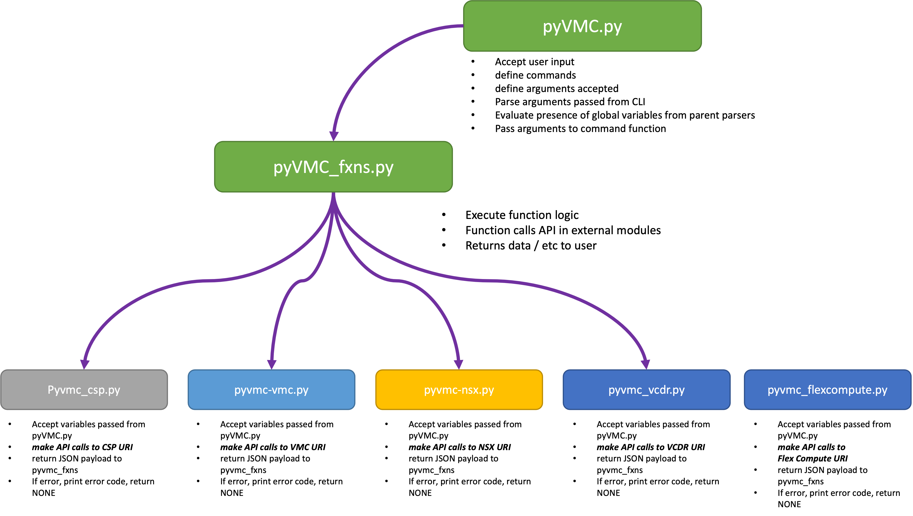
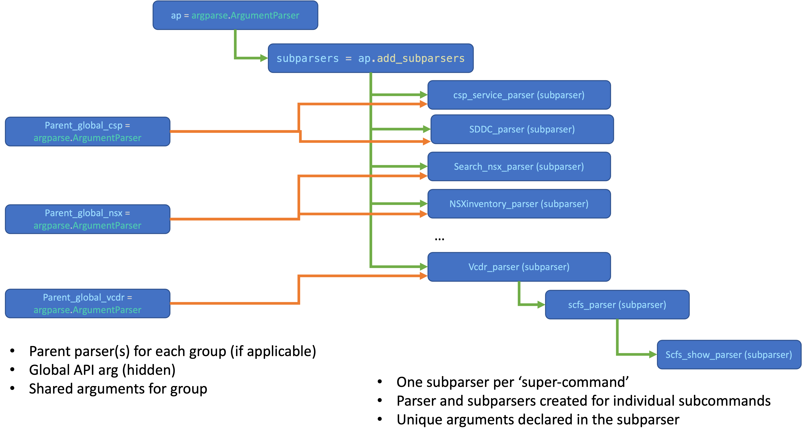

# Python Client For VMware Cloud on AWS
## Table of Contents
<!-- TOC -->

  - [1. Whats is pyVMC](#what-is-pyvmc)
  - [2. Overview](#overview)
  - [3. Getting Started](#getting-started)
    - [3.1 Install Python](#install-python)
    - [3.2 Download code](#download-code)
    - [3.3 Install Python modules and packages](#install-python-modules-and-packages)
    - [3.4 Update config.ini](#update-configini)
  - [4. Running the Script](#running-the-script)
  - [5. Support](support)
  - [6. Documentation](documentation)
  - [7. Release Notes](release-notes)
  - [8. Known Issues](known-issues)
  - [9. Contributing](contributing)
  - [10. License](10-license)

## What is pyVMC?
Welcome to the Python Client for VMware Cloud on AWS!  PyVMC is a Python tool developed for assisting system administrators with the deployment, configuration, and management of the VMware Cloud on AWS service. 

## Overview

pyVMC was created by Nicolas Vibert and Matt Dreyer.  While it started as a series of a few commands used for creating some network and firewall rules, it has grown to become a fairly comprehensive CLI that can be used for anything from adding users to your VMware Cloud organization, viewing and manipulating the route tables associated with your SDDC, configuring and updating IDS rules, or even enabling and monitoring services like Tanzu Kubernetes Service or VMware Cloud DR.

Over time, pyVMC has grown it its capabilities, in the number of commands it supports and ultimately in its complexity.  Functionality has been separated amongst several files to make navigating and updating the code easier - however this may make understanding how the project is put together a bit more challenging to understand.

As mentioned above, the functionality of the project is split up into multiple files....



Everything begins with...

**pyVMC.py** is the file where _main_ is defined, where the commands and arguments are defined for controlling user input, and where the 'business logic'/ functions are housed for handling user input and ultimately returning a result back to the screen.

A great deal of work has gone into incorporating python argparse into the project for defining and handling commands and arguments in the CLI - so the first thing you should do before adding / updating a command or function for the project is think through how the user your new functionality:
- Are you simply adding new functionality to a command that already exists?  
- Are you instead adding a new command for an existing feature? 
- Are you adding new commands for an entirely new API?

The answers to the questions above will ultimately help determine if you are adding a new category of commands ("super-command"), a new sub-command under a super-command that already exists, or just a new option for an existing subcommand.

See the image below for a graphical representation of how argparse is being used to structure commands in a hierarchical fashion.



## Getting Started

### Install Python
This tool is dependent on Python3, you can find installation instructions for your operating system in the Python documentation (https://wiki.python.org/moin/BeginnersGuide/Download).

### Download code
Download the [pyVMC.zip](https://flings.vmware.com/python-client-for-vmc-on-aws) from the Flings site

If you know git, clone the repo with

```git clone https://github.com/vmware/python-client-for-vmware-cloud-on-aws.git ```

### Install Python modules and packages
When you navigate to the python-client-for-vmware-cloud-on-aws folder, you will find a requirements.txt file that lists all your Python packages. They can all be installed by running the following command on Linux/Mac:

```pip3 install -r requirements.txt```

On Windows, use

```python -m pip install -r requirements.txt```

### Update config.ini
Obtain a refresh token from the VMware Cloud Service Portal, as well as the ORG ID and SDDC  ID of the environment you wish to interact with .  Copy config.ini.example to config.ini and edit the config.ini with your own SDDC ID, Organization (Org) ID and your access token.

> Note: The token must be scoped as either `Org Member` or `Org Owner`. It must be given the VMware Cloud on AWS roles of `NSX Cloud Admin` and `Administrator`.  API calls with a role of `Administrator (Delete Restricted)` do not work. If you are using the VCDR components of PyVMC, the token must also have a role with full administrative rights to VCDR.

### Do I need to know Python?
No! You can simply use it to consume and manage your VMware Cloud on AWS SDDC (Software-Defined Data Center). 

## Running the Script
This is super easy...
- run ./pyVMC.py to see the current list of supported commands.
- use '-h' with any super-command or with any subcommand to see the supported arguments / parameters.


For example, to see the supported sub-commands for the 'system' super-command:
```./pyVMC.py system -h ```

To see the arguments for the show-routes command:
``` ./pyVMC.py system show-routes -h ```

Try to view the route table for your SDDC:
``` ./pyVMC.py system show-routes -rt t0 ```


## Support 

### Is it officially supported by VMware?
Sorry but no, this is a community-based effort. Use it at your own risk. It has extensively been tested though and we'll endeavour to fix any bugs.

### Which version of VMware Cloud on AWS has it been tested against?
Versions 1.9, 1.10, 1.11, 1.12, 1.14... all the way up through 1.20. We don't guarantee support with previous versions. 
We will, however, endeavour to verify compatibility as we release new versions.

### What if I find a bug or need a new feature?
Please raise it on GitHub and we will look into it.

## Documentation

### Where can I find documentation about VMware Cloud on AWS:
Please check the online documentation:
https://docs.vmware.com/en/VMware-Cloud-on-AWS/index.html

### Where can I find documentation about each pyVMC commands?

#### Current Supported Commands
Here are the currently supported 'super' commands:
```shell
    csp                                 Commands related to the Cloud Service Portal itself.
    sddc                                Commands related to the Software Defined Datacenter (SDDC) itself.
    tkg                                 Commands related to the Tanzu Kubernetes Service (TKG).
    segment                             Create, delete, update, and show Virtual Machine network segments.
    vpn                                 Create, delete, update, and show virtual private network (VPN) settings.
    nat                                 Show and update Network Address Translation (NAT) rules.
    t1                                  Create, delete, update, and show secondary T1 gateways.
    vtc                                 Commands related to VMware Transit Connect (VTC).
    gwfw                                Show and update policies and rules associated with NSX Gateway Firewall (mgw, cgw, etc.).
    dfw                                 Show and update policies and rules associated with NSX Distributed Firewall.
    nsxaf                               Commands related to the NSX Advanced Firewall - e.g. IDS.
    inventory                           Show and update objects in the NSX Inventory (groups, services, etc).
    system                              Show and update configuration data associated with the NSX-T System (DNS, public IP, etc).
    search-nsx                          Search the NSX Manager inventory.
    vcdr                                Create, delete, update, and show information about VMware Cloud Disaster Recovery.
    flexcomp                            Commands related to the Cloud Flex Compute itself.
```

#### Getting Help

To see the supported commands for any given category / super-command, simply use '-h'... for example:

```shell
./pyVMC.py vcdr -h
usage:  vcdr [-h] {scfs,pg,snaps,rsddc,psite,vms} ...

positional arguments:
  {scfs,pg,snaps,rsddc,psite,vms}
                        vcdr sub-command help
    scfs                VCDR cloud file system - use '-h' for help.
    pg                  VCDR Protection Groups - use '-h' for help.
    snaps               VCDR Snapshots - use '-h' for help.
    rsddc               VCDR Recovery SDDC - use '-h' for help.
    psite               VCDR Protected Site - use '-h' for help.
    vms                 VCDR cloud file system - use '-h' for help.

optional arguments:
  -h, --help            show this help message and exit
```

Similarly, to see the options for any given command, run the individual command with the -h option:

```shell
./pyVMC.py vcdr scfs -h               
usage: vcdr scfs [-h] {show} ...

positional arguments:
  {show}      vcdr scfs sub-command help
    show      Show information about the VCDR Scale-out file System(s).

optional arguments:
  -h, --help  show this help message and exit
```

Check comprehensive listing of [all currently supported commands](/docs/all-supported-commands.md).

## Release Notes:

[Please see the release notes found here.](docs/release-notes.md)

## Known Issues:

[Please see the release notes found here.](docs/release-notes.md)

## Contributing

For a quick overview of how the project is structured as well as how the files relate to each other, how the argparse module is being used, etc, [please refer to the pyvmc-structure.md](docs/pyvmc-structure.md).

The python-client-for-vmware-cloud-on-aws project team welcomes contributions from the community. Before you start working with python-client-for-vmware-cloud-on-aws, please
read our [Developer Certificate of Origin](https://cla.vmware.com/dco). All contributions to this repository must be
signed as described on that page. Your signature certifies that you wrote the patch or have the right to pass it on
as an open-source patch. For more detailed information, refer to [CONTRIBUTING.md](CONTRIBUTING.md).

## License

SPDX-License-Identifier: BSD-2-Clause
